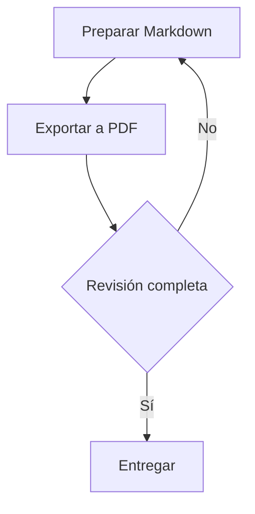

# Markdown a PDF

Skill `markdown-to-pdf` para convertir documentos Markdown a PDF. Conserva el contenido del archivo de origen. La salida predeterminada incluye un logotipo genérico con la palabra **EJEMPLO**, la leyenda **CONFIDENCIAL**, título, subtítulo y paginación. También genera un índice paginado, marcadores del PDF y rótulos para tablas e imágenes. El logotipo sirve como muestra y puede sustituirse u omitirse; no añade créditos de elaboración.

El título, subtítulo, código, versión, fecha, estado y clasificación pueden declararse una sola vez en un bloque YAML inicial `documento`. Se reutilizan en la presentación inicial y en los encabezados y pies correspondientes, sin modificar el Markdown. `pdf.portada: true` presenta esos datos en una primera página exclusiva; `pdf.logo` permite elegir un logotipo local desde el mismo Markdown.

También permite activar índices independientes de tablas y figuras, asignarles identificadores estables y escribir referencias cuyo número se actualiza automáticamente. La conversión comprueba recursos y enlaces y, con Playwright, posibles problemas de maquetación; el modo estricto detiene también las advertencias.

El contenido técnico admite diagramas Mermaid, fórmulas con KaTeX y notas numeradas con enlaces de ida y vuelta. Los diagramas y las fórmulas se renderizan con recursos incluidos en el skill, sin conexión.

El skill también puede crear un documento Markdown de ejemplo con explicaciones de sus funciones menos evidentes y recursos locales listos para usar.

Esta es la referencia completa del conversor. Consulta [INSTALL.md](INSTALL.md) para instalarlo desde GitHub y preparar sus dependencias, incluso fuera del repositorio original. El paquete de esta carpeta es autónomo; conserva sus scripts, assets y licencias juntos. La [plantilla incluida](assets/ejemplo/documento.md) muestra sus funciones.

## Licencia

El código y los recursos propios del skill se distribuyen bajo la [licencia MIT](LICENSE), con copyright de Hans Herrera. Los componentes de terceros conservan sus licencias y avisos; consulta [THIRD_PARTY_NOTICES.md](THIRD_PARTY_NOTICES.md), incluidas las condiciones de las fuentes de KaTeX.

El [logotipo de ejemplo](assets/logo.png) se generó con la herramienta integrada `imagegen` para esta plantilla. Su [prompt](assets/logo.prompt.txt) se incluye para documentar su procedencia.

## Ubicación y contenido

La implementación compartida se mantiene en esta carpeta del repositorio:

```text
.agents/skills/markdown-to-pdf/
├── SKILL.md
├── README.md
├── INSTALL.md
├── LICENSE
├── THIRD_PARTY_NOTICES.md
├── requirements.txt
├── agents/
│   └── openai.yaml
├── assets/
│   ├── print.css
│   ├── logo.png
│   ├── logo.prompt.txt
│   ├── vendor/
│   │   ├── README.md
│   │   ├── manifest.json
│   │   ├── mermaid/
│   │   └── katex/
│   └── ejemplo/
│       ├── documento.md
│       └── recursos/
│           ├── flujo.svg
│           ├── colores.css
│           └── personalizacion.css
├── scripts/
│   ├── convert_markdown_to_pdf.py
│   ├── document_cover.py
│   ├── document_footnotes.py
│   ├── document_metadata.py
│   ├── document_structure.py
│   ├── document_validation.py
│   ├── pdf_navigation.py
│   └── technical_rendering.py
└── tests/
    ├── test_advanced_conversion.py
    ├── test_agent_integration.py
    ├── test_cover.py
    ├── test_cover_conversion.py
    ├── test_cover_integration.py
    ├── test_css_imports_integration.py
    ├── test_footnotes.py
    ├── test_footnotes_integration.py
    ├── test_generated_labels_integration.py
    ├── test_indices_integration.py
    ├── test_indices_references.py
    ├── test_layout.py
    ├── test_markdown.py
    ├── test_metadata.py
    ├── test_metadata_conversion.py
    ├── test_navigation.py
    ├── test_pdf_integration.py
    ├── test_runtime.py
    ├── test_structure.py
    ├── test_technical_conversion.py
    ├── test_technical_conversion_integration.py
    ├── test_technical_rendering.py
    ├── test_technical_rendering_integration.py
    ├── test_validation.py
    ├── test_validation_conversion.py
    └── test_validation_integration.py
```

`SKILL.md` debe quedar directamente dentro de `markdown-to-pdf`. Codex descubre esta carpeta; Claude Code utiliza el adaptador del repositorio `.claude/skills/markdown-to-pdf/SKILL.md`, que lee el mismo skill y ejecuta el mismo conversor. La integración local no necesita cambiar configuraciones personales. Consulta [INSTALL.md](INSTALL.md) para instalarlo de forma personal o en otro proyecto. El alcance de Codex se describe en la [documentación oficial de skills](https://learn.chatgpt.com/docs/build-skills).

Codex puede detectar el skill en los siguientes turnos dentro de este proyecto. Si no aparece, reinicia Codex y vuelve a abrir el proyecto. Para solicitar su uso:

```text
Usa $markdown-to-pdf para convertir docs/informe.md a PDF.
```

En Claude Code, usa `/markdown-to-pdf convierte docs/informe.md a PDF`.

## Crear un ejemplo desde el skill

Puedes pedirlo sin proporcionar un documento previo:

```text
Usa $markdown-to-pdf para crear un documento básico de ejemplo que muestre
las características menos obvias del skill y explique cómo utilizarlas.
```

El skill usa [assets/ejemplo/documento.md](assets/ejemplo/documento.md) como plantilla y copia su carpeta de recursos. Sin un destino indicado, crea una carpeta nueva `ejemplo-markdown-pdf/` en la raíz del proyecto; si ya existe, utiliza un sufijo disponible. El resultado incluye el Markdown, una figura SVG local y un CSS opcional. Para obtener también el PDF, añade «y conviértelo a PDF» a la solicitud.

El ejemplo utiliza metadatos, portada e índices de tablas y figuras YAML activos y enseña cómo generan la presentación y la navegación sin repetir los datos. Incluye referencias estables que apuntan a elementos anteriores y posteriores, la precedencia de la terminal, los campos ausentes y vacíos, los marcadores, los rótulos `Tabla:` y `Figura:`, los enlaces internos, los saltos de página y los escapes dentro de tablas. Contiene un diagrama Mermaid con referencia e índice, fórmulas en línea y en bloque y notas repetidas con enlaces de regreso. Explica la validación normal y estricta y muestra errores ilustrativos solo dentro de código. También explica cómo ajustar papel, orientación, clasificación, logotipo, pie, navegación, rótulos y estilos durante la exportación. La ruta de una imagen o de `pdf.logo` se resuelve desde la carpeta del Markdown; una ruta pasada por terminal, como `--css`, se resuelve desde el directorio donde se ejecuta el comando.

La configuración inicial `pdf.portada: true` utiliza el logotipo genérico **EJEMPLO** incluido en el skill. El ejemplo de logotipo personalizado se muestra en una cerca de código para no depender de un archivo que no está incluido.

Al incorporar una función o cambiar su uso, actualiza la plantilla con un ejemplo ejecutable y una explicación breve. Verifica el ejemplo copiado en una carpeta temporal, conservando las rutas de sus recursos y el Markdown original.

## Requisitos

El formato predeterminado utiliza Python 3.10 o posterior, Playwright, pypdf y un navegador compatible instalado, como Chrome, Edge o Chromium. La configuración YAML `documento` y `pdf` requiere además **PyYAML 6.0.3**, incluido en `requirements.txt`. La portada y los índices paginados requieren Playwright y pypdf, incluso si se omiten los demás elementos; Mermaid y las matemáticas requieren Playwright; la validación estricta necesita las comprobaciones completas. Los encabezados y pies se generan mediante [las plantillas PDF de Playwright](https://playwright.dev/python/docs/api/class-page#page-pdf). El conversor reutiliza ese navegador; no es necesario descargar una copia adicional. Con `--browser` se puede indicar su ejecutable tanto para Playwright como para el motor básico.

Las dependencias se mantienen en `.venv/` dentro de la carpeta instalada, excluido del control de versiones. Para una instalación personal desde GitHub, usa la [receta independiente de la ubicación](INSTALL.md#preparar-las-dependencias-en-cualquier-ubicación). Los siguientes comandos son para una copia completa del repositorio y se ejecutan desde su raíz, con Python 3.10 o posterior. En macOS/Linux:

```shell
python3 -m venv .agents/skills/markdown-to-pdf/.venv
.agents/skills/markdown-to-pdf/.venv/bin/python -m pip install --no-cache-dir --disable-pip-version-check -r .agents/skills/markdown-to-pdf/requirements.txt
```

En Windows PowerShell, crea el entorno con `py -3 -m venv .agents/skills/markdown-to-pdf/.venv` y sustituye `.venv/bin/python` por `.venv/Scripts/python.exe` en el comando de instalación. Verifica que el Python elegido sea 3.10 o posterior. No hace falta activar el entorno; puede ejecutarse directamente su intérprete.

Esta receta instala las versiones registradas en `requirements.txt` dentro del skill y utiliza el navegador existente. No requiere Node.js, instalaciones globales ni ejecutar una descarga de navegadores de Playwright.

**Mermaid 12.0.0** y **KaTeX 0.18.7**, sus licencias y las fuentes matemáticas están incluidos en [assets/vendor](assets/vendor/README.md), con versiones y huellas de integridad registradas. Solo se cargan cuando el documento los necesita y la conversión no los descarga de un CDN. Mantén esa carpeta junto al resto del skill; no tienes que copiarla a la carpeta de cada documento.

El comando habitual con `python3` detecta el entorno local y se vuelve a ejecutar con su Python si falta en el intérprete inicial alguna dependencia necesaria para las funciones seleccionadas. No crea el entorno ni instala dependencias automáticamente. Para la salida básica, `--no-branding --no-cover --no-toc --no-table-index --no-figure-index --no-bookmarks --no-strict --engine browser` permite convertir con Python 3.9 o posterior y el navegador instalado sin paquetes adicionales cuando no se utilizan los bloques YAML `documento` o `pdf`, diagramas Mermaid ni fórmulas. Esos bloques requieren PyYAML también con el motor básico; los ajustes de metadatos por terminal y las notas no requieren ese paquete por sí solos. Ese motor informa que la validación es parcial.

## Uso desde la terminal

Los comandos de este manual muestran la instalación por proyecto, desde su raíz. En una instalación personal, sustituye `.agents/skills/markdown-to-pdf` por la ruta absoluta del skill instalado; no hace falta copiarlo al proyecto del documento. La [guía de instalación](INSTALL.md) muestra ese caso. Las rutas de documentos entre comillas pueden ser relativas al directorio de ejecución o absolutas.

```shell
python3 .agents/skills/markdown-to-pdf/scripts/convert_markdown_to_pdf.py "documento.md"
python3 .agents/skills/markdown-to-pdf/scripts/convert_markdown_to_pdf.py "documento.md" --output "documento-final.pdf"
python3 .agents/skills/markdown-to-pdf/scripts/convert_markdown_to_pdf.py "documento.md" --paper Letter --landscape
```

Sin `--output`, el PDF utiliza el mismo nombre y carpeta que el Markdown. La carpeta de destino debe existir. Cada ejecución convierte un archivo y conserva el original. Al terminar, el programa informa la ruta del PDF y el motor utilizado.

Para indicar un navegador instalado:

```shell
python3 .agents/skills/markdown-to-pdf/scripts/convert_markdown_to_pdf.py "documento.md" --browser "ruta/al/ejecutable"
```

Para una salida básica sin portada, encabezado, pie, índices ni marcadores, con validación parcial y sin Mermaid ni fórmulas:

```shell
python3 .agents/skills/markdown-to-pdf/scripts/convert_markdown_to_pdf.py "documento.md" --no-branding --no-cover --no-toc --no-table-index --no-figure-index --no-bookmarks --no-strict --engine browser
```

Para sustituir el logotipo durante una conversión:

```shell
python3 .agents/skills/markdown-to-pdf/scripts/convert_markdown_to_pdf.py "documento.md" --logo "ruta/al/logotipo.png"
```

El logotipo genérico **EJEMPLO** de `assets/logo.png` es el valor predeterminado. Para cambiarlo en todas las conversiones futuras, sustituye ese archivo por otro PNG sin modificar el código. Para omitirlo en una conversión, usa `--no-logo`; el encabezado y el pie restantes se conservan. El logotipo es una muestra de presentación y no atribuye autoría al documento.

## Metadatos dentro del Markdown

Coloca un bloque YAML al principio del archivo, entre dos líneas `---`. Este ejemplo declara todos los campos admitidos y comienza directamente con el contenido, sin repetir un título o una tabla de datos:

```markdown
---
documento:
  titulo: "Especificación de Requisitos de Software"
  subtitulo: "Sistema de registro y control de asistencia"
  codigo: "ERS-001"
  version: "0.1"
  fecha: "2026-09-13"
  estado: "Borrador"
  clasificacion: "CONFIDENCIAL"
---

Este documento describe los requisitos del sistema.

## 1. Propósito y alcance

El sistema permite registrar…
```

Los datos son ilustrativos. Escribe todos los valores entre comillas para que sean texto, especialmente versiones como `"0.10"` y fechas como `"2026-09-13"`. El conversor no asigna una fecha actual, una versión ni un título cuando faltan.

| Campo YAML | Opción de terminal | Uso en el PDF |
| --- | --- | --- |
| `documento.titulo` | `--title TEXT` | Título inicial H1 y título del pie. |
| `documento.subtitulo` | `--subtitle TEXT` | Subtítulo inicial H2 y segunda línea del pie. |
| `documento.codigo` | `--document-code TEXT` | Fila Código de los datos iniciales. |
| `documento.version` | `--document-version TEXT` | Fila Versión de los datos iniciales. |
| `documento.fecha` | `--document-date TEXT` | Fila Fecha de los datos iniciales. |
| `documento.estado` | `--document-status TEXT` | Fila Estado de los datos iniciales. |
| `documento.clasificacion` | `--classification TEXT` | Fila Clasificación de los datos iniciales y leyenda del encabezado. |

La precedencia se aplica **campo por campo**: opción explícita de terminal, valor YAML y dato inicial reconocido del Markdown, en ese orden. Para un documento existente, se pueden recuperar el H1, el subtítulo inicial reconocido y los campos de la tabla inicial `Dato | Valor`. El conversor no utiliza una sección ordinaria del cuerpo como subtítulo en este modo. Puedes empezar con `documento: {}` para reutilizar los datos ya escritos y ajustar solo algunos con la terminal.

Al heredar el título o subtítulo desde esa tabla, conserva su formato, enlaces, fórmulas y llamadas a notas en el encabezado inicial o la portada. Los valores que se escriben explícitamente en YAML o se pasan por terminal son texto literal.

Un campo ausente permite esa recuperación; un campo con `null` o `""` lo omite explícitamente e impide recuperarlo desde el cuerpo. Por ejemplo, `subtitulo: ""` elimina el subtítulo de la presentación inicial y del pie. También puedes pasar `--subtitle ""` o `--document-status ""` para esa conversión. La clasificación ausente usa **CONFIDENCIAL** en el encabezado si no existe otro valor reconocido; ese valor predeterminado no añade una fila de clasificación al cuerpo. `clasificacion: ""`, `clasificacion: null` o `--classification ""` omiten la leyenda; al usar metadatos centralizados, omiten también su fila.

La presencia de `documento`, de una de las nuevas opciones de metadatos o de una portada activa genera o actualiza el título, subtítulo y tabla inicial sin duplicar los campos. Conserva las demás filas de la tabla, la introducción, el cuerpo y el control de cambios. Si no hay datos tabulares, omite la tabla. El índice y los rótulos se calculan sobre el resultado; la tabla de metadatos, cuando existe, recibe su rótulo habitual «Tabla 1. Datos del documento».

Para una exportación con versión y estado distintos de los declarados:

```shell
python3 .agents/skills/markdown-to-pdf/scripts/convert_markdown_to_pdf.py "documento.md" --document-version "0.2" --document-status "En revisión"
```

Las opciones de terminal no escriben los cambios en el archivo de origen. Los documentos sin `documento`, sin las nuevas opciones de metadatos y sin portada conservan el comportamiento anterior, incluso al usar únicamente `--classification`. En ese caso, el pie sigue utilizando el primer H1 y el primer H2; una tabla manual de metadatos sigue siendo contenido del cuerpo. `--no-branding` desactiva el encabezado, el pie y todos los logotipos, pero mantiene los datos visibles y la portada solicitada.

El front matter por sí solo no dibuja un título o una tabla en un visor común de Markdown. El conversor interpreta esos datos durante la exportación; la portada se activa por separado como se describe a continuación.

## Portada configurable

Añade `pdf` junto a `documento` en el mismo bloque YAML inicial:

```markdown
---
documento:
  titulo: "Especificación de requisitos"
  subtitulo: "Sistema de asistencia"
  codigo: "ERS-001"
  version: "0.1"
  fecha: "2026-09-13"
  estado: "Borrador"
  clasificacion: "CONFIDENCIAL"
pdf:
  portada: true
---

Esta introducción forma parte del cuerpo y aparece después del índice.

## 1. Propósito

El sistema permite registrar la asistencia.
```

La portada reutiliza el título, el subtítulo y la tabla de metadatos en una primera página exclusiva, con el logotipo incluido en el skill. No repite esos elementos en el cuerpo. También puede tomar los datos iniciales reconocidos de un Markdown existente, conservando sus anclas. La introducción y el control de cambios permanecen en el cuerpo. Los campos ausentes se omiten y los campos documentales vacíos conservan las reglas de la sección anterior.

El orden es **portada → índice de secciones → índice de tablas → índice de figuras → introducción y cuerpo**, incluyendo solo los índices activos que tengan elementos. La portada cuenta como página 1 y no imprime encabezado ni pie repetidos. Las demás páginas conservan `Página N de T` con el número físico del PDF: no se reinicia la numeración tras la portada. Los enlaces, los marcadores y las páginas de los índices se calculan con esta distribución. La tabla de metadatos sigue siendo «Tabla 1. Datos del documento», por lo que no desplaza las referencias existentes; el logotipo queda fuera de la numeración de figuras.

| Configuración | Comportamiento |
| --- | --- |
| `pdf.portada: true` | Activa una primera página exclusiva. |
| `pdf.portada: false` o campo ausente | Presenta los datos al inicio sin una página exclusiva. |
| `--cover` / `--no-cover` | Prevalece sobre `pdf.portada` para esa exportación. |
| `pdf.logo: "./imagenes/logo.png"` | Usa ese archivo local en la portada y el encabezado; la ruta parte de la carpeta del Markdown. |
| `pdf.logo: null` | Omite el logotipo. |
| `pdf.logo` ausente | Usa `assets/logo.png` del skill. |
| `--logo FILE` / `--no-logo` | Prevalece sobre `pdf.logo`; la ruta de terminal parte de la carpeta de ejecución. |
| `--no-branding` | Omite encabezado, pie y logotipos; conserva la portada solicitada y los metadatos visibles. |

`portada` exige `true` o `false` sin comillas; `"true"`, `null` y otros valores se rechazan. El logotipo admite PNG, JPEG o SVG locales. La ruta de ejemplo `./imagenes/logo.png` debe sustituirse por un archivo existente antes de incluirla como configuración activa. `pdf.logo` también funciona cuando `portada` está desactivada. El bloque `pdf` no configura papel, orientación ni CSS: utiliza las opciones de terminal para esos ajustes.

Para exportar el mismo documento sin su portada, conservando la presentación inicial de metadatos:

```shell
python3 .agents/skills/markdown-to-pdf/scripts/convert_markdown_to_pdf.py "documento.md" --no-cover --output "documento-sin-portada.pdf"
```

La plantilla ajusta el título y el espaciado al tamaño y orientación del papel. Si los datos de la portada no caben en una sola página, la conversión informa un error; acorta los textos o revisa el papel y los estilos personalizados. La portada necesita Playwright y pypdf incluso con `--no-branding --no-toc --no-bookmarks`.

## Opciones

| Opción | Función |
| --- | --- |
| `-o`, `--output FILE` | Define la ruta de salida, con extensión `.pdf`. |
| `--paper A4\|Letter\|Legal` | Tamaño del papel; predeterminado: A4. |
| `--landscape` | Orientación horizontal. |
| `--css FILE` | Añade una hoja CSS después de los estilos incluidos. |
| `--engine auto\|playwright\|browser` | Selecciona el motor; predeterminado: `auto`. |
| `--browser FILE` | Ruta al ejecutable del navegador para `browser` o Playwright. |
| `--cover`, `--no-cover` | Activa u omite la portada; prevalece sobre `pdf.portada`. Desactivada cuando no se configura. |
| `--logo FILE` | Sustituye el logotipo de portada y encabezado por un PNG, JPEG o SVG local; prevalece sobre `pdf.logo`. Predeterminado: `assets/logo.png`. |
| `--no-logo` | Omite los logotipos de portada y encabezado; conserva la leyenda, el pie y la portada. |
| `--title TEXT` | Define el título del documento; prevalece sobre `documento.titulo`. |
| `--subtitle TEXT` | Define el subtítulo; prevalece sobre `documento.subtitulo`. |
| `--document-code TEXT` | Define el código; prevalece sobre `documento.codigo`. |
| `--document-version TEXT` | Define la versión; prevalece sobre `documento.version`. |
| `--document-date TEXT` | Define la fecha como texto; prevalece sobre `documento.fecha`. |
| `--document-status TEXT` | Define el estado; prevalece sobre `documento.estado`. |
| `--classification TEXT` | Define la clasificación; prevalece sobre `documento.clasificacion`. Sin otro valor, el encabezado usa `CONFIDENCIAL`. Usa `--classification ""` para omitirla. |
| `--footer` | Activa título, subtítulo y `Página N de T` al pie; ya está activo de forma predeterminada. |
| `--no-footer` | Desactiva solo el pie; conserva la leyenda y el logotipo. |
| `--no-branding` | Desactiva encabezado, pie y todos los logotipos; conserva portada y metadatos visibles. |
| `--toc`, `--no-toc` | Activa u omite el índice con enlaces y páginas reales; activo por defecto. |
| `--toc-depth N` | Niveles relativos del índice, entre 1 y 6; predeterminado: 2. |
| `--table-index`, `--no-table-index` | Activa u omite el índice de tablas; prevalece sobre `pdf.indice_tablas`. Desactivado si no se configura. |
| `--figure-index`, `--no-figure-index` | Activa u omite el índice de figuras; prevalece sobre `pdf.indice_figuras`. Desactivado si no se configura. |
| `--bookmarks`, `--no-bookmarks` | Activa u omite los marcadores nativos del PDF; activos por defecto. |
| `--captions`, `--no-captions` | Activa u omite los rótulos numerados generados, activos por defecto. `--no-captions` conserva los textos explícitos `Tabla: …` y `Figura: …`, los índices activos y las referencias. |
| `--strict`, `--no-strict` | Detiene o permite advertencias; prevalece sobre `pdf.validacion: estricta` o `normal`. Predeterminado: normal. Los errores siempre detienen la conversión. |
| `--force` | Permite reemplazar un PDF existente. |
| `--diagnose` | Muestra los motores y recursos disponibles; no garantiza que el navegador pueda iniciarse. |
| `--help` | Muestra la ayuda del programa. |

En modo `auto`, la portada, el encabezado, el pie, los índices, los marcadores, Mermaid y las fórmulas requieren Playwright. La portada y los índices paginados utilizan también pypdf. El motor `browser` admite la salida básica seleccionada con `--no-branding --no-cover --no-toc --no-table-index --no-figure-index --no-bookmarks --no-strict`, siempre que no contenga Mermaid ni fórmulas; puede conservar los rótulos, las referencias y las notas porque se generan sin dependencias adicionales. Con esa salida, `auto` puede recurrir al navegador instalado si Playwright no está disponible. Informa que la validación es parcial; no admite el modo estricto.

## Índice, marcadores y rótulos

Sin portada, el índice se inserta después del título, la introducción y los metadatos, antes de la primera sección del cuerpo, con saltos de página alrededor. Con portada, el índice aparece inmediatamente después de ella, antes de la introducción. Si no hay secciones, se omite. El índice no vuelve a copiar versión, fecha, estado o control de cambios. `--toc-depth 2` incluye dos niveles de secciones relativos a la estructura del documento; no significa limitarse a los encabezados H1 y H2.

Las páginas de todos los índices activos se calculan desde los destinos reales del PDF mediante pypdf. El conversor repite la exportación cuando insertar los índices cambia la distribución, hasta que sus páginas coinciden con los destinos, con un máximo de cuatro pasadas. Si no se estabiliza, informa un error. Los marcadores son nativos del PDF y permiten navegar por los encabezados desde el panel del lector; se generan junto con las etiquetas estructurales del PDF.

Los rótulos numeran tablas y figuras por separado. Para definir un título, añade un párrafo `Tabla: Título` inmediatamente antes de una tabla o `Figura: Título` antes de una imagen. Con `--captions`, activo por defecto, ese párrafo se convierte en su rótulo numerado, sin repetirlo. La tabla inicial de metadatos recibe «Tabla 1. Datos del documento» cuando se reconoce su estructura, también en la portada; no se duplican sus campos. Los logotipos de portada y encabezado quedan fuera de la numeración de figuras.

`--no-captions` omite los rótulos numerados generados. Los párrafos explícitos `Tabla: …` y `Figura: …` permanecen como texto del cuerpo: por ejemplo, `Tabla: Estados {#tbl:estados}` se imprime como `Tabla: Estados`. El sufijo `{#tbl:estados}` se procesa como un destino estable y no aparece impreso. Los índices activos, las referencias y sus números y enlaces se conservan. Si el elemento no tiene un párrafo explícito, no se le añade un título visible inferido; los índices siguen utilizando ese título.

Sin título explícito, las tablas toman el encabezado de sección cercano, sin su prefijo de numeración, o los nombres de sus columnas; las imágenes toman su título o texto alternativo. Si falta esa información, se usan «Contenido tabular» o «Imagen del documento». Para que las referencias resulten útiles, conviene escribir títulos descriptivos. Los destinos generados siguen `table-N` y `figure-N`, conservan un identificador existente y añaden un sufijo cuando hay colisiones.

Los rótulos y sus destinos se generan durante la exportación; el Markdown original permanece intacto. Puedes referenciarlos con enlaces como `[ver tabla](#table-1)` y `[ver figura](#figure-1)`. Estos enlaces manuales dependen de la posición del elemento; utiliza identificadores estables para referencias que se actualicen al reordenar el contenido.

## Índices de tablas y figuras

Añade estas opciones al bloque YAML inicial `pdf`:

```yaml
pdf:
  indice_tablas: true
  indice_figuras: true
```

Cada listado se activa por separado y está desactivado si no se configura. Usa `true` o `false` sin comillas. `--table-index` / `--no-table-index` y `--figure-index` / `--no-figure-index` prevalecen sobre el YAML para esa exportación. `--no-toc` omite solo el índice de secciones: no desactiva los listados de tablas y figuras. Un listado sin elementos se omite sin reservar una página.

Cada entrada presenta número, título, enlace y página final. Utiliza el mismo título explícito o inferido que alimenta el rótulo generado del elemento. La tabla de metadatos se incluye, aunque aparezca en la portada; los logotipos no son figuras. `--no-captions` omite los rótulos numerados generados junto al elemento y conserva los textos explícitos `Tabla: …` y `Figura: …`, los listados y su numeración. Los enlaces llevan a la tabla o figura correspondiente.

Con portada, los listados aparecen después del índice de secciones y antes de la introducción, primero tablas y luego figuras. Sin portada, el bloque inicial mantiene su posición antes de los índices. La paginación tiene en cuenta todos los listados activos, incluidos los que ocupan varias páginas. Cada listado paginado necesita Playwright y pypdf.

Para generar solo el índice de figuras:

```shell
python3 .agents/skills/markdown-to-pdf/scripts/convert_markdown_to_pdf.py "documento.md" --no-toc --no-table-index --figure-index
```

## Referencias cruzadas automáticas

Escribe un identificador estable al final del rótulo y utilízalo en el texto con `[@identificador]`:

```markdown
Consulta [@tbl:estados] y [@fig:flujo].

Tabla: Estados permitidos {#tbl:estados}

| Estado | Significado |
| --- | --- |
| Abierto | En curso |
| Cerrado | Finalizado |

Figura: Flujo del proceso {#fig:flujo}


```

En el PDF, las referencias se convierten en enlaces como «Tabla 2» y «Figura 1», según la posición real de cada elemento. Los ejemplos no fijan esos números: la tabla inicial de metadatos y los elementos anteriores también cuentan. Las referencias pueden aparecer antes o después del destino. Al insertar o reordenar tablas o figuras, conserva sus identificadores y el número visible se actualiza sin editar las referencias.

El sufijo `{#tbl:estados}` o `{#fig:flujo}` se retira del rótulo visible. Usa nombres descriptivos y únicos, con `tbl:` para tablas y `fig:` para figuras. Después del prefijo, el nombre debe empezar por una letra ASCII o un dígito; los caracteres siguientes pueden ser letras ASCII, dígitos, `_`, `.`, `:` o `-`. No utiliza espacios ni acentos, aunque el título visible sí puede tenerlos. Los identificadores duplicados, en conflicto con otro destino o referenciados sin existir producen errores. La sintaxis dentro de código en línea o de cercas de código se conserva literalmente; una referencia escapada como `\[@tbl:estados]` también queda como texto.

`--no-captions` no desactiva las referencias ni su numeración. Los enlaces manuales existentes a `#table-N` y `#figure-N` siguen disponibles; su significado depende del orden. Los identificadores estables también permiten enlaces con texto propio, por ejemplo `[estados permitidos](#tbl:estados)`. Los visores comunes de Markdown pueden mostrar la sintaxis automática como texto; se resuelve durante esta exportación.

## Contenido técnico

### Textos de índices, pies y marcadores

Las referencias activas se resuelven también en encabezados, rótulos inferidos, índices, pies y título interno del PDF, aunque su destino aparezca después. Por ejemplo, `## Detalle de [@tbl:datos]` alimenta el rótulo de una tabla sin título con el número ya resuelto.

Los índices de secciones, tablas y figuras conservan las fórmulas y el formato del título o rótulo original. Cada entrada enlaza a su propio destino; los enlaces que hubiera dentro del título se copian como texto para no anidar enlaces. Las llamadas a notas se muestran como `[n]` en las etiquetas copiadas, sin crear nuevas notas ni llamadas de regreso. El encabezado o rótulo original conserva su llamada enlazada.

Los pies, marcadores y título interno del PDF usan una representación textual de las fórmulas, obtenida de su estructura matemática renderizada:

| Construcción | Representación textual |
| --- | --- |
| Fracción | `(a)/(b)` |
| Potencia o índice | `x^(2)`, `x_(i)`; una base compuesta se agrupa entre paréntesis. |
| Raíz | `sqrt(x)` o `root(3, x)` |
| Matriz | Filas separadas por `;` y columnas por `,`, por ejemplo `[a, b; c, d]`. |
| Símbolos | Se conservan como Unicode, por ejemplo `α`, `∑` o `≤`. |
| Anotaciones sobre o bajo una expresión | `over(x, ¯)` o `under(x, …)`, sin confundirlas con exponentes. |
| Llamada a nota | `[1]`, con el número de la llamada original. |

Esta notación permite leer el contenido en lugares que solo admiten texto; el cuerpo y los índices mantienen la fórmula dibujada. Los ejemplos escritos en código, los escapes y los valores explícitos de YAML o terminal conservan su carácter literal. La actualización de marcadores conserva sus destinos y jerarquía, incluso con títulos repetidos; para marcadores que contienen fórmulas o notas se utiliza pypdf, incluido en las dependencias locales.

### Renderizado local

No requiere nuevas opciones YAML ni de terminal. El conversor detecta las construcciones activas fuera del código; Mermaid y las fórmulas seleccionan Playwright en modo `auto` y producen un error si se solicita expresamente el motor básico `browser`. La salida espera a que terminen el renderizado y la carga de fuentes antes de calcular los índices y comprobar la maquetación. Un fallo de sintaxis o un recurso técnico faltante impide publicar el PDF y conserva una salida previa.

### Diagramas Mermaid

Escribe una cerca de código con el lenguaje `mermaid`. Se renderiza como una figura SVG con texto; usa el rótulo anterior y un identificador estable para incluirla en referencias e índices:

````markdown
Consulta [@fig:revision].

Figura: Revisión de un documento {#fig:revision}


````

Comparte la numeración de las demás figuras y participa en `pdf.indice_figuras`, con su página final. `--no-captions` omite el rótulo numerado generado y conserva el párrafo explícito `Figura: …`, el índice activo y las referencias. Para mostrar la sintaxis sin renderizarla, usa una cerca de lenguaje `text` o encierra la muestra completa en una cerca exterior de cuatro acentos graves, como hace este README.

El motor incluido desactiva etiquetas HTML e interacciones del diagrama; el PDF presenta un gráfico estático. No necesita recursos remotos. Un diagrama muy ancho o alto puede quedar pequeño al ajustarse al papel: divídelo o cambia la orientación y revisa el resultado visual. Un error de sintaxis Mermaid detiene la conversión.

Los límites configurados se aplican a cada bloque `mermaid`, sin sumar los diagramas del documento:

- **50 000 caracteres de código fuente (`maxTextSize`)**, medidos como unidades UTF-16 de JavaScript; algunos símbolos, como ciertos emojis, cuentan como dos unidades. Se incluyen espacios, comentarios, saltos de línea y configuración interna del diagrama. Las cercas Markdown no forman parte de ese contenido.
- **500 aristas o conexiones (`maxEdges`)** en los diagramas `flowchart`/`graph` y `agentflow`, que aplican este control en el motor incluido. Cuenta las conexiones resultantes: `A & B --> C & D` crea cuatro aristas. Otros tipos de diagrama no utilizan necesariamente este límite.

Se admiten exactamente 50 000 unidades o 500 aristas; superar el límite correspondiente detiene la exportación y conserva el PDF previo, incluso con `--force`. El exceso de texto se informa como «supera 50 000 caracteres» y el de conexiones como `Edge limit exceeded`, con la ruta y línea del bloque. Simplifica el diagrama, divídelo en varios bloques o utiliza una imagen PNG local. Son valores fijos del conversor: no hay una opción de terminal para aumentarlos y el YAML o las directivas internas de Mermaid no los modifican, aunque el mensaje del motor mencione `mermaid.initialize`.

El tipo `journey` no está admitido actualmente: genera etiquetas HTML dentro del SVG que este conversor no puede imprimir como imagen. Un diagrama `journey` válido detiene la exportación con el diagnóstico `mermaid-journey-unsupported`, la ruta del Markdown y la línea del bloque. Es una limitación del conversor. Puedes exportar el diagrama como una imagen PNG local y enlazarla desde el Markdown, o representar el recorrido con un tipo compatible, como `flowchart`. El fallo conserva cualquier PDF previo, incluso con `--force`.

### Fórmulas matemáticas

En texto, usa `$...$` o `\(...\)`. Para una fórmula independiente, coloca `$$` o `\[` y su cierre correspondiente en líneas propias, o la fórmula completa entre esos delimitadores en una sola línea:

```markdown
La proporción es $r = a / b$ y el área es \(A = \pi r^2\).

$$
\bar{x} = \frac{1}{n} \sum_{i=1}^{n} x_i
$$

\[
E = mc^2
\]

$$ a^2 + b^2 = c^2 $$
```

KaTeX admite expresiones y comandos de TeX compatibles con su motor; no procesa documentos LaTeX completos, preámbulos, paquetes adicionales ni comandos que inserten HTML o recursos externos. Las macros de una fórmula no se propagan a las siguientes. Un comando no admitido, una fórmula inválida o un delimitador explícito sin cierre produce un error, en lugar de imprimir una fórmula incompleta.

Los importes como `$5` se conservan como texto y un dólar suelto no abre una fórmula sin cierre. Escapa el dólar como `\$` si puede confundirse con un delimitador. El contenido en código en línea o cercas de código permanece literal, incluidos los delimitadores. Las fórmulas extensas no se dividen automáticamente en varias líneas: escríbelas en varios bloques o utiliza una construcción de alineación compatible y comprueba que entren en el papel.

Las fórmulas también pueden estar dentro de texto con formato y de enlaces, por ejemplo `*Producto $x*y$*` y `[Intervalo $\left[0,1\right)$](https://example.com)`. Los delimitadores del formato o del enlace no alteran el contenido de la fórmula.

### Notas numeradas

Las llamadas usan `[^id]` y las definiciones `[^id]: Texto`. Una definición puede aparecer antes o después de las llamadas; el orden de la primera llamada determina el número:

```markdown
La revisión usa una muestra representativa.[^muestra]
La misma nota puede citarse otra vez.[^muestra]
Este criterio es ilustrativo.[^revisión]

[^revisión]: Ajusta el criterio al documento.
[^muestra]: Incluye portada, tablas, diagramas y fórmulas.

    Este segundo párrafo continúa la nota con cuatro espacios.
```

Las notas se reúnen al final del documento bajo **Notas**, incluido en el índice de secciones y los marcadores. **No se colocan al pie de cada página.** Las llamadas son enlaces a la definición y cada definición contiene enlaces de regreso a todas sus llamadas. Al repetir un identificador se conserva el número; reordenar las primeras llamadas actualiza la numeración automáticamente.

Los identificadores de notas admiten acentos, sin espacios ni corchetes, y son independientes de los identificadores `tbl:` y `fig:`. Puedes usar texto con formato, enlaces y varios párrafos en una definición; las continuaciones llevan cuatro espacios. Las notas sin definición, definiciones duplicadas, definiciones sin ninguna llamada y notas dentro de otras notas son errores. Los ejemplos escritos dentro de código se conservan literalmente, también en cercas dentro de listas; una definición mostrada allí no sirve como definición de una llamada real fuera del código.

## Formato y personalización

Admite `.md`, `.markdown` y `.mdown` codificados en UTF-8. Procesa encabezados, párrafos, negritas, cursivas, tachado, código, listas anidadas y sus continuaciones, casillas de tareas, citas, tablas, enlaces e imágenes. Resuelve imágenes y enlaces relativos desde la carpeta del Markdown.

Conserva los caracteres escapados, las barras inversas y las barras verticales escapadas (`\|`) dentro de las celdas, incluso en código en línea. Admite código en línea delimitado por dos acentos graves. Los encabezados reciben identificadores únicos y los enlaces internos pueden apuntar a títulos con acentos.

Los estilos incluidos permiten ajustar las líneas de textos y tablas con contenido largo y limitan las imágenes al área imprimible del papel y la orientación seleccionados. Comprueba el resultado visual cuando uses contenido extenso o estilos personalizados.

Para un salto de página, escribe `<!-- pagebreak -->` en una línea independiente. Puedes ajustar [assets/print.css](assets/print.css) o añadir estilos mediante `--css`.

La hoja personalizada admite `@import` al principio, antes de sus reglas de estilo. Se aplica después de los estilos incluidos; las reglas de papel, orientación y márgenes que genera el conversor se añaden al final. La plantilla incluye un ejemplo ejecutable: `recursos/personalizacion.css` importa `recursos/colores.css`. Actívalo al exportar con `--css recursos/personalizacion.css` desde la carpeta del ejemplo.

El encabezado predeterminado muestra **CONFIDENCIAL**. El pie, activo por defecto, utiliza título y subtítulo de la fuente común de metadatos cuando está activa; sin esa configuración, los deriva del primer H1 y del primer H2 del documento. Si no hay subtítulo, omite esa línea. La numeración utiliza el formato `Página N de T`. La portada oculta encabezado y pie en su primera página y cuenta para la numeración posterior. El logotipo predeterminado procede de `assets/logo.png`; puede configurarse con `pdf.logo`, sustituirse con `--logo` u omitirse con `--no-logo`. No se toma de las imágenes del cuerpo ni se deduce del nombre del proyecto.

El pie reserva espacio para la numeración. Si el título o subtítulo no cabe en su línea, lo abrevia con puntos suspensivos (`…`) solo en el pie; el título y subtítulo completos se conservan en el documento.

El soporte de Markdown es parcial; no garantiza compatibilidad completa con CommonMark. Mermaid, las fórmulas y las notas tienen el alcance indicado en [contenido técnico](#contenido-técnico); las notas se agrupan al final y KaTeX no es un compilador de documentos LaTeX. El HTML del Markdown se muestra como texto, sin ejecutarse.

La conversión de texto e imágenes locales se realiza localmente. Las imágenes remotas del Markdown y los recursos remotos del CSS personalizado pueden requerir conexión.

## Validación de recursos, enlaces y maquetación

La validación se ejecuta al convertir. Los errores detienen la publicación del PDF; las advertencias permiten producirlo en modo normal y requieren revisar el diagnóstico. Para tratar también las advertencias como fallos, configura:

```yaml
pdf:
  validacion: estricta
```

Los valores admitidos son `normal` y `estricta`; si no se configura, se usa `normal`. `--strict` y `--no-strict` prevalecen sobre el YAML. El modo normal mantiene los errores activos. Por ejemplo:

```shell
python3 .agents/skills/markdown-to-pdf/scripts/convert_markdown_to_pdf.py "documento.md" --strict
```

| Comprobación | Resultado ante un problema |
| --- | --- |
| Imagen local ausente o inaccesible | Error con el recurso y la ubicación disponible. |
| Archivo local ausente citado por `url(...)` o `@import` en el CSS | Error con la ruta; el diagnóstico señala el archivo CSS cuando está disponible. |
| Imagen que no llega a cargarse en Playwright | Error; incluye el logotipo y detecta archivos existentes que el navegador no puede interpretar. |
| Enlace al propio documento con un destino inexistente | Error; incluye enlaces del cuerpo además de los índices. |
| Destino interno que existe en el HTML pero falta en el PDF final | Error, por ejemplo si el CSS oculta la sección enlazada. |
| Referencia estable sin destino, duplicada o en conflicto | Error antes de publicar la salida. |
| Posible desbordamiento o contenido fuera del área imprimible | Advertencia de maquetación; el modo estricto la convierte en fallo. |
| Contenido recortado verticalmente por una altura limitada y `overflow` | Advertencia `layout-vertical-clipping` con el elemento y sus dimensiones; el modo estricto detiene la salida. |
| Página inesperadamente vacía | Advertencia con la página detectada; el modo estricto la convierte en fallo. |

Los diagnósticos distinguen errores y advertencias, incluyen un código y señalan la ruta, línea de origen o página cuando están disponibles. Por ejemplo, `resource-missing` indica un archivo ausente, `anchor-missing` un destino interno inexistente, `pdf-anchor-missing` un destino que falta en el PDF final e `image-load-failed` una imagen que el navegador no pudo cargar. Entre las advertencias están `layout-horizontal-overflow`, `layout-vertical-clipping`, `layout-unbreakable-height`, `layout-positioned-outside` y `pdf-blank-page`. Corrige el recurso, el destino o el contenido indicado y vuelve a exportar.

La hoja principal indicada con `--css` se inserta en el documento: sus rutas relativas `url(...)` y `@import` parten de la **carpeta del Markdown**, aunque ese archivo CSS esté en otra carpeta. Una hoja cargada mediante `@import` resuelve sus propias rutas y sus importaciones adicionales desde la **ubicación de esa hoja importada**. La ruta de `--css FILE` parte del directorio de ejecución. Se comprueba la existencia de los archivos locales citados directamente en el HTML y la hoja principal; no se recorre de forma recursiva el contenido de las hojas importadas ni se solicitan recursos remotos durante esa comprobación estática. La validación de enlaces internos se refiere al propio documento: no inspecciona fragmentos de otros archivos Markdown ni garantiza la disponibilidad de sitios web enlazados.

El aviso de recorte vertical comprueba áreas con `overflow-y: hidden`, `clip`, `auto` o `scroll` cuyo contenido supera la altura disponible. Tener una barra de desplazamiento en pantalla no garantiza que el PDF incluya el contenido oculto. Revisa las alturas fijas, `max-height` y las reglas de impresión; por ejemplo, `pre { height: 12mm; overflow: hidden; }` puede perder líneas de código. La copia auxiliar de accesibilidad de KaTeX no genera este aviso, pero sí se comprueba su representación visible.

Los enlaces que mencionan el propio archivo, como `[sección](documento.md#seccion)` dentro de `documento.md`, se convierten en enlaces internos del PDF y se validan igual que `#seccion`.

Playwright permite comprobar la carga de las imágenes y la maquetación; pypdf comprueba las páginas y destinos internos del PDF final. Si falta pypdf en una salida que pueda generarse sin él, se informa de validación parcial; el modo estricto detiene ese aviso. El motor básico `browser` ejecuta las comprobaciones estáticas y emite una advertencia de **validación parcial**; no ofrece las comprobaciones completas ni admite el modo estricto. La presencia de una imagen no garantiza su carga en ese motor. Para una verificación completa utiliza Playwright y las dependencias locales de `requirements.txt`.

Los saltos explícitos `<!-- pagebreak -->` son intencionales y no se consideran por sí solos un fallo. Los avisos de maquetación localizan posibles problemas: revisa el elemento o la página indicados, en especial con CSS personalizado. La validación complementa la revisión visual; no certifica toda la apariencia del documento.

El conversor trabaja con una salida temporal y publica el resultado cuando las comprobaciones requeridas terminan. Un fallo de validación conserva un PDF anterior, incluso cuando se ha utilizado `--force`.

## Comprobación y solución de problemas

El conversor comprueba que el PDF tenga contenido, comience con `%PDF-` y termine con `%%EOF`. Si el navegador termina sin producir una salida completa, el intento falla sin agotar el tiempo de espera. Antes de reintentar, elimina la salida temporal del intento anterior.

Revisa una muestra de páginas para verificar portada si está activa, títulos, tablas, acentos, encabezado, pie, logotipo, índices y rótulos activos. Comprueba que la portada ocupe solo la primera página y que los enlaces, referencias y marcadores lleven a sus destinos. Atiende las advertencias de validación. Las comprobaciones automáticas no garantizan por sí solas la fidelidad visual.

Para investigar un problema de motores o recursos:

```shell
python3 .agents/skills/markdown-to-pdf/scripts/convert_markdown_to_pdf.py --diagnose
```

No es necesario ejecutar este diagnóstico antes de cada conversión.

- Si no hay un motor disponible, identifica el navegador que falta o indica un ejecutable compatible con `--browser`.
- Si el formato solicitado necesita Playwright y no está disponible, prepara el entorno local con la receta autorizada del apartado de requisitos. Si falta un navegador compatible, indica esa dependencia; no cambies el formato solicitado sin acuerdo.
- Si falta PyYAML para leer `documento` o `pdf`, utiliza el entorno local con la versión fijada en `requirements.txt`. No borres la configuración para eludir la dependencia.
- Si la configuración no es válida, corrige el bloque YAML indicado por el error: usa los nombres de campo admitidos y valores de texto entre comillas, `null` o `""` para los datos documentales. Para `pdf.portada`, `pdf.indice_tablas` y `pdf.indice_figuras`, usa `true` o `false` sin comillas; para `pdf.logo`, una ruta local o `null`; para `pdf.validacion`, `normal` o `estricta`.
- Si la portada no cabe, revisa la longitud de los datos, el papel y el CSS personalizado. Si falta el logotipo, corrige `pdf.logo` desde la carpeta del Markdown o `--logo` desde la carpeta de ejecución.
- Si un índice no logra una paginación estable, revisa la distribución y los estilos personalizados antes de reintentar; no utilices páginas supuestas.
- Si falta una imagen o no carga, corrige la ruta desde el Markdown o sustituye el recurso por un archivo que el navegador pueda interpretar.
- Si falla un enlace o una referencia, comprueba el destino indicado; conserva los acentos de las anclas y usa identificadores estables únicos para tablas y figuras.
- Si aparecen advertencias de maquetación, revisa la ubicación indicada, la longitud del contenido, el papel y el CSS. El modo estricto detiene también estos avisos; no omitas una validación estricta solicitada para conseguir una salida.
- Si aparece `mermaid-journey-unsupported`, el tipo `journey` requiere una imagen PNG local o un tipo de diagrama compatible; consulta [diagramas Mermaid](#diagramas-mermaid). Ante un error de sintaxis de diagrama o fórmula, corrige la ubicación indicada; comprueba que el comando matemático sea compatible con KaTeX. Si falta o fue modificado un recurso del motor, restaura los archivos fijados en `assets/vendor/manifest.json`.
- Si falla una nota, revisa que tenga una sola definición, al menos una llamada y ninguna llamada a otra nota dentro de la definición. Las notas se muestran al final bajo «Notas».
- Si falta la hoja de estilos, restaura `assets/print.css` conservando la estructura del paquete.
- Si el PDF ya existe, el programa se detiene. Usa `--force` cuando se haya solicitado reemplazarlo.
- Para probar modificaciones del skill, utiliza documentos y salidas temporales en un entorno aislado y conserva los documentos de trabajo.

## Pruebas del conversor

Para ejecutar la suite con las dependencias locales, utiliza desde la raíz del proyecto:

```shell
.agents/skills/markdown-to-pdf/.venv/bin/python -B -m unittest discover -s .agents/skills/markdown-to-pdf/tests -v
```

Las pruebas se ejecutan con `unittest`. `test_markdown.py` comprueba la estructura y el contenido del HTML generado; `test_metadata.py` comprueba la lectura y validación de metadatos, la precedencia, los campos vacíos y la conservación del contenido existente. `test_metadata_conversion.py` verifica su integración con las opciones de terminal, el formato y el entorno local. `test_cover.py` verifica la configuración y estructura de la portada, los logotipos y la conservación de los datos y anclas; `test_cover_conversion.py` comprueba la precedencia de las opciones de portada y logotipo, los requisitos de motores y dependencias y los fallos de conversión. `test_runtime.py` verifica la validación de salida, los fallos y los reintentos con procesos simulados; `test_layout.py` comprueba las opciones de presentación y las plantillas de encabezado y pie. `test_structure.py` comprueba la selección de secciones y los rótulos; `test_navigation.py` comprueba los destinos y la paginación del índice. La opción `-B` evita crear archivos de caché de Python.

`test_indices_references.py` comprueba los listados independientes, los identificadores estables, las referencias al reordenar elementos y los errores de destinos. `test_advanced_conversion.py` cubre las opciones YAML y de terminal de los índices y la validación. `test_validation.py` comprueba recursos, enlaces, diagnósticos y páginas vacías.

`test_footnotes.py` comprueba definiciones, continuaciones, código literal, numeración por primera llamada, identificadores Unicode, enlaces en ambos sentidos y errores de notas. `test_technical_rendering.py` verifica la integridad de los recursos incluidos, las fuentes matemáticas embebidas y que un documento sin contenido técnico no los necesite.

`test_technical_conversion.py` cubre la detección de Mermaid y matemáticas, los delimitadores, importes y código literal, fórmulas en tablas, énfasis y enlaces, errores de sintaxis y la selección del motor y del entorno local.

Para incluir las pruebas de integración con el navegador instalado, ejecuta:

```shell
MDPDF_BROWSER_TESTS=1 .agents/skills/markdown-to-pdf/.venv/bin/python -B -m unittest discover -s .agents/skills/markdown-to-pdf/tests -v
```

`test_pdf_integration.py` crea un documento temporal con un índice de varias páginas, títulos repetidos, una tabla y una figura. Comprueba las páginas impresas del índice, los destinos, los marcadores, los rótulos y el encabezado, pie y logotipo de cada página. También exporta documentos con metadatos YAML y opciones de terminal, cambia su fuente y comprueba el título interno del PDF, la tabla inicial y el pie, conservando el contenido histórico.

`test_cover_integration.py` comprueba las variantes con y sin portada, logotipo y elementos de encabezado y pie; verifica las páginas del índice y los destinos del PDF, los títulos largos y los documentos que solo contienen una portada. También comprueba que una portada que no cabe produzca un error sin reemplazar un PDF existente. Las pruebas de integración se omiten cuando no se establece `MDPDF_BROWSER_TESTS=1`. No sustituyen la revisión visual de una muestra del PDF final.

`test_indices_integration.py` verifica los destinos y páginas de los índices de tablas y figuras en PDFs reales, incluidas referencias automáticas y listados extensos. `test_validation_integration.py` comprueba imágenes y maquetación con el navegador. `test_validation_conversion.py` verifica el modo estricto, fallos previos al renderizado, logotipos corruptos, destinos ocultos en el PDF, enlaces que mencionan el propio Markdown y la conservación de una salida previa.

`test_css_imports_integration.py` comprueba la resolución de rutas y las importaciones anidadas, la precedencia de las hojas y su efecto real en el PDF, incluida la combinación con portada e índices. Verifica también los recortes provocados por CSS importado en modo normal y estricto y la conservación del PDF previo ante fallos.

`test_technical_rendering_integration.py` comprueba Mermaid y KaTeX con el navegador sin acceso a la red, la conservación del identificador de figura, varios tipos de diagrama, errores con ubicación de origen y la impresión en un PDF real.

`test_footnotes_integration.py` verifica la numeración y los destinos de ida y vuelta en PDFs reales con llamadas repartidas en varias páginas, el contenido de las definiciones, el índice y los marcadores, la salida básica y la conservación del PDF previo ante errores de notas.

`test_technical_conversion_integration.py` combina portada, índices, referencias y contenido técnico en una exportación estricta; comprueba fórmulas dentro de énfasis y enlaces y títulos heredados con fórmulas y notas, con y sin portada. Verifica los errores de sintaxis sin reemplazar una salida previa y que las fórmulas con desbordamiento visible sigan produciendo diagnósticos de maquetación.

`test_generated_labels_integration.py` comprueba referencias adelantadas en textos derivados, índices con fórmulas y notas sin duplicar llamadas, títulos textuales del pie y del PDF y marcadores repetidos con destinos distintos. Incluye variantes con portada y sin índices ni rótulos generados.

`test_agent_integration.py` verifica las entradas de los agentes y la resolución del adaptador de Claude Code hacia el motor compartido en una copia temporal con espacios en las rutas. Las comprobaciones de conversión con navegador no equivalen a una sesión de Claude Code. Estas pruebas se omiten si se instala solo el núcleo, sin el adaptador de Claude Code; las demás pruebas pertenecen al paquete autónomo.

Verificación del 16 de septiembre de 2026: 351 pruebas aprobadas con `MDPDF_BROWSER_TESTS=1` en el repositorio completo. En una instalación autónoma sin Claude Code, se omiten las dos pruebas del adaptador. El ejemplo completo genera 14 páginas con Playwright, Google Chrome y `--strict`, sin incidencias: 16 entradas de secciones, 4 tablas, 2 figuras, 3 notas, 53 enlaces internos y 21 marcadores. Se comprobaron la conservación del Markdown, los destinos y una muestra visual de páginas.

La instalación desde el repositorio público se verificó con el helper de Codex: 117 archivos descargados e idénticos al paquete publicado, dependencias instaladas en un entorno nuevo y un PDF de 14 páginas generado desde otra carpeta con `--strict`, sin incidencias y conservando el Markdown. Codex detectó la instalación descargada como una entrada habilitada y sin errores. También se probó el rechazo de una instalación duplicada. `journey` conserva la limitación documentada en [diagramas Mermaid](#diagramas-mermaid).
