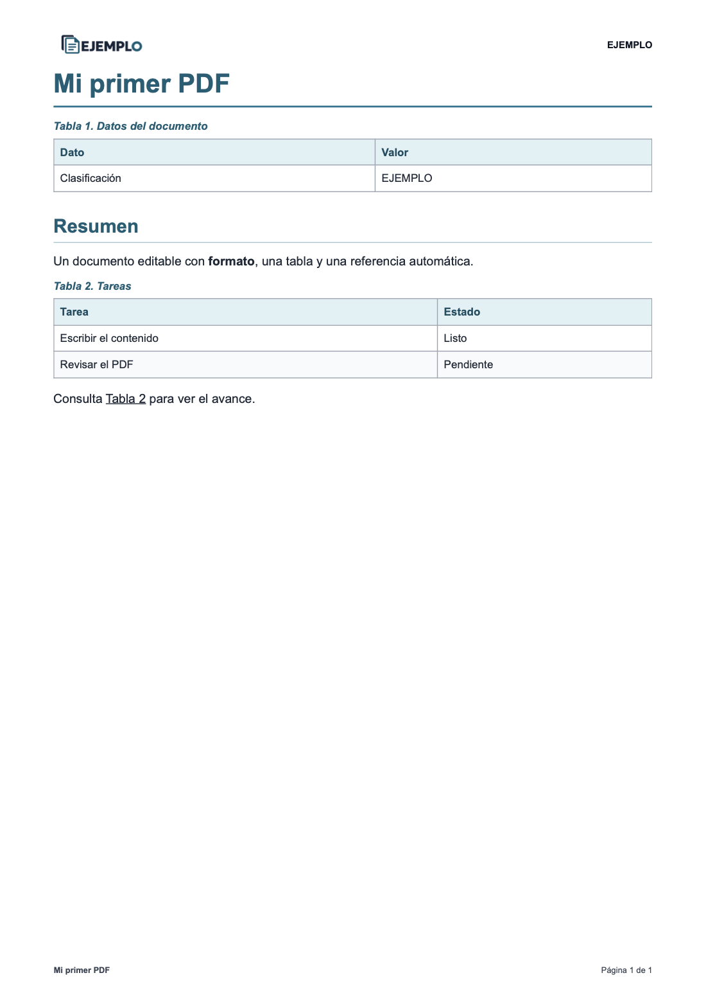
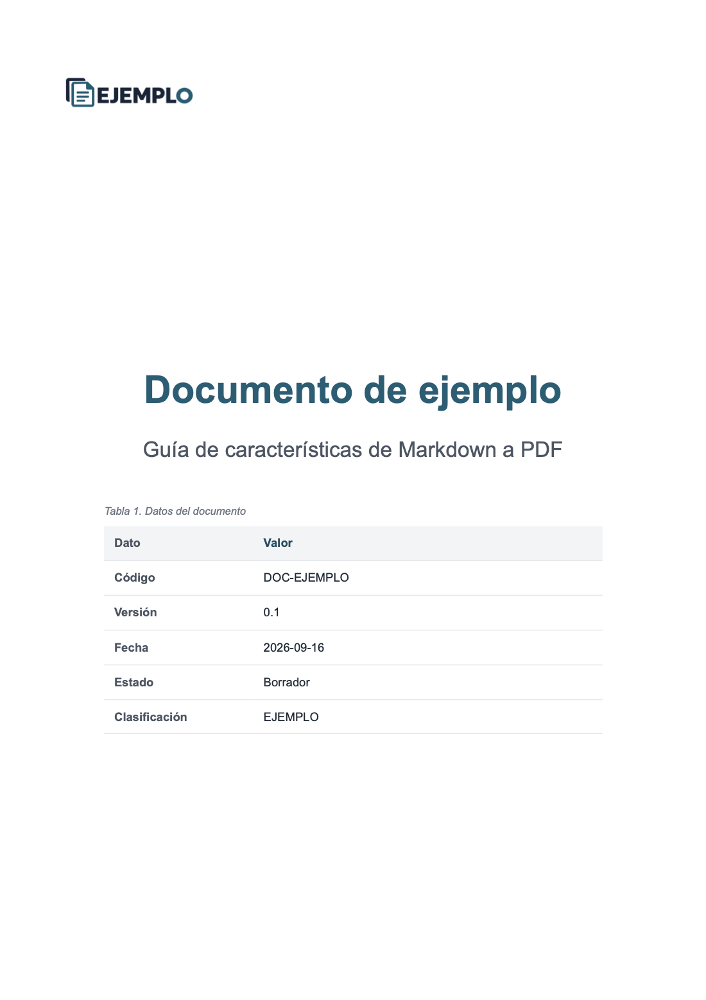
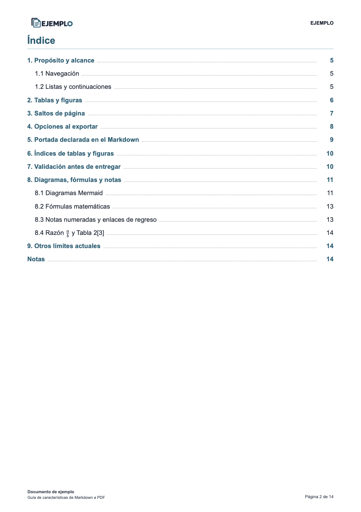
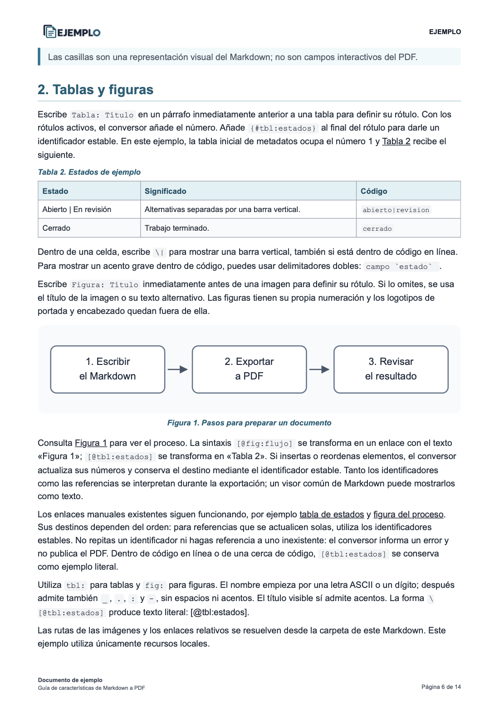
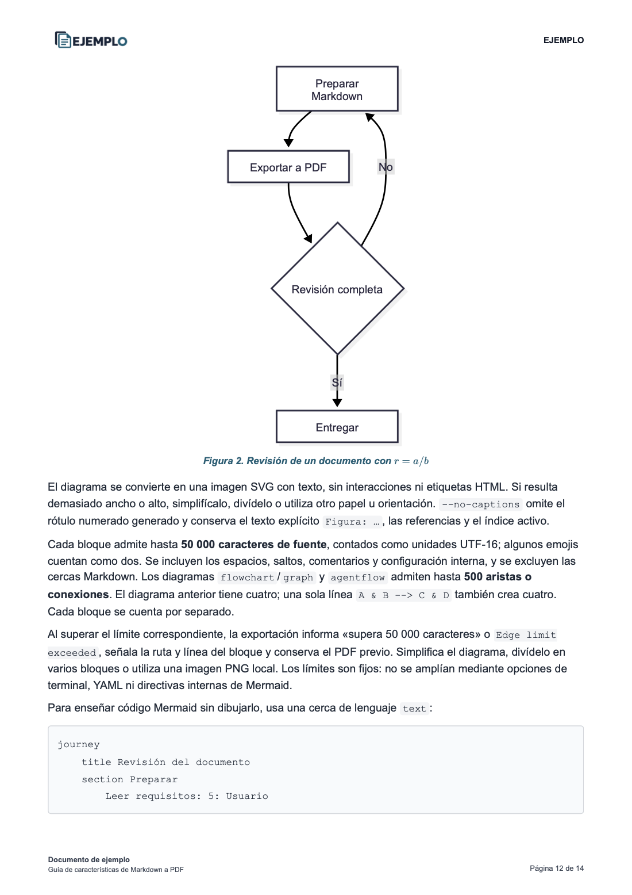
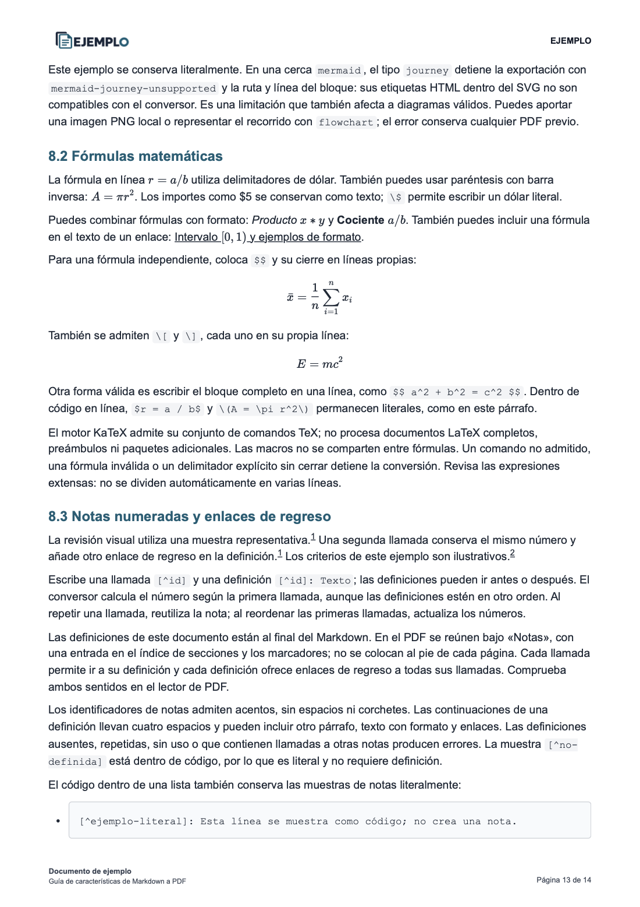

# Ejemplos: del Markdown al PDF

Empieza con un documento breve y después explora el ejemplo completo. Todos los datos y la identidad gráfica son ilustrativos.

| Ejemplo | Contenido | Archivos |
| --- | --- | --- |
| Básico, 1 página | Metadatos, tabla y referencia automática. | [Markdown](basico.md) · [PDF](basico.pdf) |
| Completo, 14 páginas | Portada, índices, tablas, figuras, Mermaid, fórmulas, notas y personalización. | [Markdown](documento.md) · [PDF](documento.pdf) |

## Un ejemplo breve

Este es el contenido completo de [basico.md](basico.md):

```markdown
---
documento:
  titulo: "Mi primer PDF"
  clasificacion: "EJEMPLO"
---

## Resumen

Un documento editable con **formato**, una tabla y una referencia automática.

Tabla: Tareas {#tbl:tareas}

| Tarea | Estado |
| --- | --- |
| Escribir el contenido | Listo |
| Revisar el PDF | Pendiente |

Consulta [@tbl:tareas] para ver el avance.
```

El conversor usa el YAML para presentar el título y una tabla de metadatos, que ocupa el número 1. La tabla de tareas recibe el rótulo **«Tabla 2. Tareas»** y `[@tbl:tareas]` se convierte en un enlace **«Tabla 2»**. El identificador `{#tbl:tareas}` no se imprime.

GitHub permite leer el Markdown, pero no interpreta todas estas extensiones. El PDF y las capturas muestran el resultado del conversor.

## Exportar desde la terminal

Prepara las dependencias siguiendo la [guía de inicio](../README.md#empezar). Desde la raíz del repositorio, en macOS/Linux:

```shell
.agents/skills/markdown-to-pdf/.venv/bin/python .agents/skills/markdown-to-pdf/scripts/convert_markdown_to_pdf.py \
  ejemplo-markdown-pdf/basico.md \
  --no-toc --css ejemplo-markdown-pdf/recursos/personalizacion.css \
  --strict --output ejemplo-markdown-pdf/basico-nuevo.pdf
```

Para reproducir el ejemplo completo, conserva el índice de secciones:

```shell
.agents/skills/markdown-to-pdf/.venv/bin/python .agents/skills/markdown-to-pdf/scripts/convert_markdown_to_pdf.py \
  ejemplo-markdown-pdf/documento.md \
  --css ejemplo-markdown-pdf/recursos/personalizacion.css \
  --strict --output ejemplo-markdown-pdf/documento-nuevo.pdf
```

En Windows PowerShell, usa `.venv/Scripts/python.exe` en lugar de `.venv/bin/python` y escribe cada comando en una sola línea, sin las barras `\` de continuación. Las salidas nuevas permiten compararlas con los PDFs incluidos. El Markdown original se conserva; utiliza `--force` solo cuando quieras reemplazar una salida existente.

## Pedirlo a Codex o Claude Code

En Codex:

```text
Usa $markdown-to-pdf para convertir ejemplo-markdown-pdf/documento.md
a ejemplo-markdown-pdf/documento-nuevo.pdf con
ejemplo-markdown-pdf/recursos/personalizacion.css y validación estricta.
```

En Claude Code:

```text
/markdown-to-pdf convierte ejemplo-markdown-pdf/documento.md
a ejemplo-markdown-pdf/documento-nuevo.pdf con
ejemplo-markdown-pdf/recursos/personalizacion.css y validación estricta.
```

La [guía de integración](../docs/integracion-agentes.md) explica la instalación y las comprobaciones de cada agente.

## Capturas del resultado

Estas imágenes se exportaron de los PDFs incluidos, generados con Playwright y Google Chrome. Pulsa una captura para ampliarla. Los enlaces, marcadores y referencias funcionan en el PDF; las imágenes solo muestran su aspecto.

| Ejemplo básico — página 1 | Ejemplo completo — portada, página 1 |
| --- | --- |
| [](capturas/basico.png) | [](capturas/portada.png) |

| Índice — página 2 | Tablas y figuras — página 6 |
| --- | --- |
| [](capturas/indice.png) | [](capturas/tablas-figuras.png) |

| Mermaid — página 12 | Fórmulas y notas — página 13 |
| --- | --- |
| [](capturas/mermaid.png) | [](capturas/formulas-notas.png) |

El [PDF completo](documento.pdf) contiene 53 enlaces internos y 21 marcadores. La página 14 reúne las definiciones de las notas y sus enlaces de regreso. Cambiar el contenido, el papel, las fuentes o el CSS puede cambiar la paginación.

## Recursos

Conserva la carpeta `recursos/` junto al Markdown:

- [flujo.svg](recursos/flujo.svg): figura local del ejemplo completo.
- [personalizacion.css](recursos/personalizacion.css): estilos utilizados en ambos PDFs.
- [colores.css](recursos/colores.css): paleta importada por la hoja de estilos.

El logotipo predeterminado y los motores de Mermaid y KaTeX pertenecen al skill. Puedes configurar otro logotipo con `pdf.logo` o `--logo`, u omitirlo con `--no-logo`. El documento completo distingue la configuración activa de las opciones mostradas como código ilustrativo.

## Actualizar PDFs y capturas

Para actualizar deliberadamente los PDFs incluidos, repite los comandos anteriores usando `--output ejemplo-markdown-pdf/basico.pdf --force` y `--output ejemplo-markdown-pdf/documento.pdf --force`, respectivamente. Revisa los diagnósticos y las páginas antes de actualizar las capturas.

En macOS, con las herramientas de desarrollo de Swift instaladas:

```shell
swift ejemplo-markdown-pdf/generar-capturas.swift
```

El [script](generar-capturas.swift) exporta seis páginas mediante PDFKit y reemplaza los PNG de `capturas/`. Si cambia la paginación, actualiza la selección de páginas del script y los rótulos de esta galería. En otros sistemas puedes exportar esas páginas como PNG desde un visor de PDF. Las capturas no son necesarias para ejecutar el conversor.

El contenido de los ejemplos se distribuye bajo la [licencia MIT del skill](../.agents/skills/markdown-to-pdf/LICENSE).
