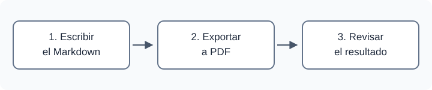
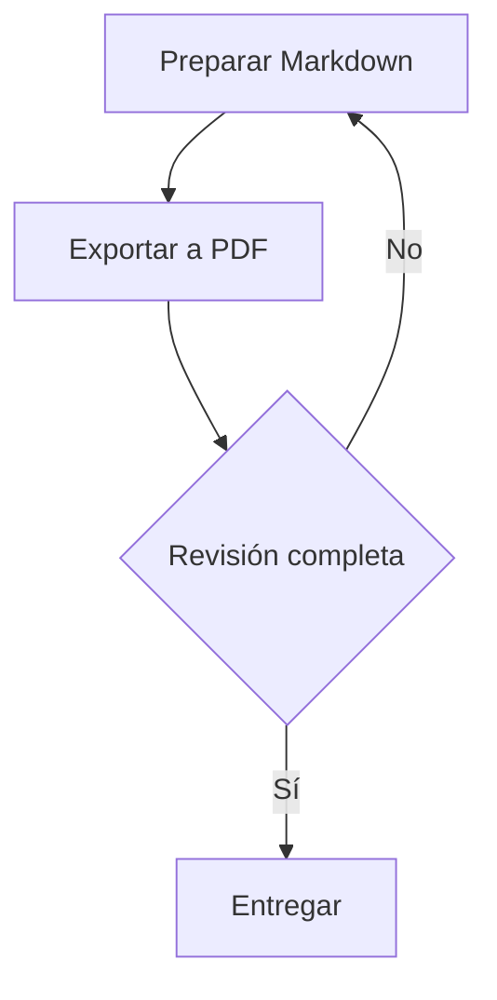

---
documento:
  titulo: "Documento de ejemplo"
  subtitulo: "Guía de características de Markdown a PDF"
  codigo: "DOC-EJEMPLO"
  version: "0.1"
  fecha: "2026-09-16"
  estado: "Borrador"
  clasificacion: "EJEMPLO"
pdf:
  portada: true
  indice_tablas: true
  indice_figuras: true
  validacion: normal
---

Este documento muestra cómo escribir las funciones menos evidentes del conversor. Copia también la carpeta `recursos/` junto a este archivo para conservar la imagen y los estilos opcionales. Los datos son ilustrativos.

Los bloques YAML iniciales `documento` y `pdf` son configuración activa: al exportar generan una portada con el título, el subtítulo, el logotipo genérico **EJEMPLO** y la tabla «Tabla 1. Datos del documento», además de índices de secciones, tablas y figuras. El título y el subtítulo también se reutilizan en el pie de las páginas siguientes; la clasificación aparece en su encabezado. Los datos se escriben una sola vez, sin repetir un H1, un subtítulo o una tabla al principio del cuerpo. Esta introducción aparece después de los índices. El conversor conserva este archivo sin cambios.

Escribe los valores entre comillas, incluso la versión y la fecha. Puedes eliminar un campo del YAML para recuperar el dato que ya exista en un título, subtítulo o tabla inicial reconocidos del Markdown; si no existe, se omite sin inventarlo. Para omitirlo expresamente, utiliza `null` o `""`; por ejemplo, `subtitulo: ""` elimina la segunda línea del pie. Una clasificación ausente usa CONFIDENCIAL en el encabezado si no hay otro dato inicial; `clasificacion: ""` la omite. Un visor común de Markdown puede mostrar el YAML como metadatos, sin dibujar los elementos que genera el PDF.

## 1. Propósito y alcance

Sustituye los textos de ejemplo por tu contenido. Puedes combinar **negritas**, *cursivas*, ~~texto descartado~~ y `código en línea`.

### 1.1 Navegación

El PDF genera un índice con enlaces y páginas reales, además de marcadores en el panel lateral del lector. Con la configuración predeterminada, incluye dos niveles de secciones: en este documento, H2 y H3. En este ejemplo, el orden es portada, índice de secciones, índice de tablas, índice de figuras e introducción y cuerpo. La portada cuenta como página 1, sin imprimir allí encabezado ni pie; las páginas siguientes continúan la numeración física del PDF.

Los enlaces internos admiten acentos: [volver al propósito](#1-propósito-y-alcance). Escribe el destino en minúsculas, conserva los acentos, elimina la puntuación y sustituye los espacios por guiones. Los títulos repetidos reciben sufijos; usa títulos distintos para facilitar las referencias.

Las referencias también pueden apuntar a elementos que aparecen más adelante: consulta [@tbl:estados] y [@fig:flujo]. Su número se calcula al exportar; no tienes que escribirlo en el texto.

### 1.2 Listas y continuaciones

- [x] Preparar el contenido.
- [ ] Revisar el documento.
  - [x] Comprobar las tablas y las imágenes.
  - [ ] Confirmar los enlaces del PDF.

  Este párrafo continúa dentro de la tarea «Revisar el documento» porque conserva la sangría.

1. Ajustar los datos iniciales.
2. Exportar y revisar una muestra de páginas.

> Las casillas son una representación visual del Markdown; no son campos interactivos del PDF.

## 2. Tablas y figuras

Escribe `Tabla: Título` en un párrafo inmediatamente anterior a una tabla para definir su rótulo. Con los rótulos activos, el conversor añade el número. Añade `{#tbl:estados}` al final del rótulo para darle un identificador estable. En este ejemplo, la tabla inicial de metadatos ocupa el número 1 y [@tbl:estados] recibe el siguiente.

Tabla: Estados de ejemplo {#tbl:estados}

| Estado | Significado | Código |
| --- | --- | --- |
| Abierto \| En revisión | Alternativas separadas por una barra vertical. | `abierto\|revision` |
| Cerrado | Trabajo terminado. | `cerrado` |

Dentro de una celda, escribe `\|` para mostrar una barra vertical, también si está dentro de código en línea. Para mostrar un acento grave dentro de código, puedes usar delimitadores dobles: ``campo `estado` ``.

Escribe `Figura: Título` inmediatamente antes de una imagen para definir su rótulo. Si lo omites, se usa el título de la imagen o su texto alternativo. Las figuras tienen su propia numeración y los logotipos de portada y encabezado quedan fuera de ella.

Figura: Pasos para preparar un documento {#fig:flujo}



Consulta [@fig:flujo] para ver el proceso. La sintaxis `[@fig:flujo]` se transforma en un enlace con el texto «Figura 1»; `[@tbl:estados]` se transforma en «Tabla 2». Si insertas o reordenas elementos, el conversor actualiza sus números y conserva el destino mediante el identificador estable. Tanto los identificadores como las referencias se interpretan durante la exportación; un visor común de Markdown puede mostrarlos como texto.

Los enlaces manuales existentes siguen funcionando, por ejemplo [tabla de estados](#table-2) y [figura del proceso](#figure-1). Sus destinos dependen del orden: para referencias que se actualicen solas, utiliza los identificadores estables. No repitas un identificador ni hagas referencia a uno inexistente: el conversor informa un error y no publica el PDF. Dentro de código en línea o de una cerca de código, `[@tbl:estados]` se conserva como ejemplo literal.

Utiliza `tbl:` para tablas y `fig:` para figuras. El nombre empieza por una letra ASCII o un dígito; después admite también `_`, `.`, `:` y `-`, sin espacios ni acentos. El título visible sí admite acentos. La forma `\[@tbl:estados]` produce texto literal: \[@tbl:estados].

Las rutas de las imágenes y los enlaces relativos se resuelven desde la carpeta de este Markdown. Este ejemplo utiliza únicamente recursos locales.

## 3. Saltos de página

Para comenzar el contenido siguiente en otra página, coloca esta instrucción en una línea independiente, fuera de un bloque de código:

```markdown
<!-- pagebreak -->
```

Justo después de este párrafo hay un salto real. El índice también incorpora sus propios saltos de página durante la exportación.

<!-- pagebreak -->

## 4. Opciones al exportar

Las opciones de presentación se piden al skill o se pasan al conversor. Los datos de `documento`, la portada, el logotipo, los índices de tablas y figuras y el modo de validación pueden declararse en YAML; papel, orientación y estilos se configuran al exportar. Por ejemplo, puedes solicitar:

```text
Usa $markdown-to-pdf para convertir este documento.md a PDF en papel
Letter horizontal, sin logotipo, con clasificación «EJEMPLO» y con
recursos/personalizacion.css de la carpeta de este documento.
```

Tabla: Opciones de presentación disponibles {#tbl:opciones}

| Ajuste | Opciones del conversor y comportamiento |
| --- | --- |
| Título y subtítulo | `--title TEXT` y `--subtitle TEXT` prevalecen sobre los valores YAML y actualizan el inicio y el pie. Usa `""` para omitir uno. |
| Datos documentales | `--document-code TEXT`, `--document-version TEXT`, `--document-date TEXT` y `--document-status TEXT` prevalecen sobre el YAML y actualizan la tabla inicial. |
| Portada | `--cover` y `--no-cover` prevalecen sobre `pdf.portada`; al omitirla, los metadatos quedan al inicio sin una página exclusiva. |
| Papel y orientación | `--paper A4`, `--paper Letter` o `--paper Legal`; `--landscape` para horizontal. A4 vertical es el valor predeterminado. |
| Logotipo | `pdf.logo` elige un PNG, JPEG o SVG local y `null` lo omite. `--logo FILE` y `--no-logo` prevalecen sobre el YAML. Si no eliges otro, se usa el logotipo genérico **EJEMPLO**. |
| Clasificación | `--classification "EJEMPLO"` prevalece sobre el YAML y actualiza la leyenda y su fila; `--classification ""` las omite. Si no se aporta ningún valor, el encabezado utiliza CONFIDENCIAL. |
| Pie de página | Incluye título, subtítulo y `Página N de T`. Los textos largos se abrevian con `…` solo en el pie para conservar visible la numeración. `--no-footer` lo omite; `--footer` lo activa. |
| Encabezado y pie | `--no-branding` omite ambos y todos los logotipos; conserva la portada solicitada y los metadatos visibles. |
| Índice de secciones | `--no-toc` lo omite; `--toc` lo activa. `--toc-depth 1` muestra solo las secciones principales; se admiten valores de 1 a 6. |
| Índices de tablas y figuras | `pdf.indice_tablas` y `pdf.indice_figuras` los activan con `true`. `--table-index` / `--no-table-index` y `--figure-index` / `--no-figure-index` prevalecen sobre el YAML. |
| Marcadores | `--no-bookmarks` los omite; `--bookmarks` los activa. Son independientes del índice impreso. |
| Rótulos | `--no-captions` omite los rótulos numerados generados y conserva los textos explícitos `Tabla: …` y `Figura: …`; `--captions` activa su generación. Los índices activos y las referencias conservan sus números. |
| Estilos | `--css FILE` añade CSS después de los estilos del skill. El archivo `recursos/personalizacion.css` de este ejemplo cambia colores y rótulos. |
| Validación | `pdf.validacion: normal` informa advertencias y detiene los errores. `estricta` detiene también las advertencias. `--strict` / `--no-strict` prevalecen sobre el YAML. |
| Destino | `--output FILE` elige la salida. Sin esa opción, se crea un PDF con el mismo nombre y carpeta del Markdown. |

El CSS opcional no se carga por estar junto al Markdown: hay que solicitarlo al exportar. Las rutas pasadas como opciones de terminal, como `--css` y `--logo`, se resuelven desde la carpeta de ejecución; el skill debe indicar la ruta correcta al archivo elegido. La imagen del cuerpo y `pdf.logo` se resuelven desde este documento.

La hoja opcional `recursos/personalizacion.css` empieza con esta importación real, antes de sus reglas:

```css
@import "recursos/colores.css";
```

El `@import` y los `url(...)` escritos en la hoja principal parten de la carpeta de este Markdown, porque el conversor inserta esa hoja en el documento. Una hoja importada resuelve sus propias rutas desde su ubicación. La validación estática comprueba los archivos locales citados directamente, sin recorrer el contenido de las hojas importadas. Conserva los dos CSS de `recursos/` al copiar el ejemplo; todos sus recursos son locales.

La precedencia de cada dato es: opción explícita de terminal, valor YAML y dato inicial reconocido del Markdown. Por ejemplo, `--document-version "0.2" --document-status "En revisión"` cambia esos dos datos solo para esa exportación; el YAML mantiene los valores originales. Los campos vacíos explícitos impiden recuperar otro valor. Si no hay bloque `documento`, nuevas opciones de metadatos ni portada, se conserva el formato anterior: primer H1 y primer H2 en el pie, con la tabla manual intacta.

Consulta el README del skill para los comandos de terminal, los motores disponibles y los requisitos. Si el PDF de destino ya existe, el conversor se detiene; `--force` permite reemplazarlo cuando se solicite.

## 5. Portada declarada en el Markdown

La portada de este ejemplo se activa con `pdf.portada: true` en el bloque YAML inicial. Usa `true` o `false` sin comillas: `"true"` y `null` no son valores válidos para esta opción. Cambia ese valor a `false` o utiliza `--no-cover` para exportar los mismos datos al inicio del documento sin una página exclusiva. Si omites la opción, la portada está desactivada.

Para elegir un logotipo propio, añade `logo` al bloque `pdf` inicial. Esta muestra está dentro de una cerca de código: `mi-logo.png` es una ruta ilustrativa y debes reemplazarla por un archivo local existente antes de usarla:

```yaml
pdf:
  portada: true
  logo: "./recursos/mi-logo.png"
```

El archivo puede ser PNG, JPEG o SVG y su ruta se interpreta desde la carpeta del Markdown. Se usa en portada y encabezado, también cuando `portada` está desactivada. Si omites `logo`, se mantiene el logotipo incluido en el skill; `logo: null` lo oculta. `--logo FILE` y `--no-logo` tienen prioridad sobre el YAML. La figura `recursos/flujo.svg` de este documento es contenido del cuerpo y no se utiliza como logotipo.

`--no-branding` omite encabezado, pie y todos los logotipos; conserva la portada y sus datos. Para omitir la portada utiliza `--no-cover`. Las anclas y los números de tablas se conservan al mover los metadatos a la portada: la tabla de estados sigue siendo `#table-2`.

La plantilla adapta el título y el espaciado al papel y su orientación; si los datos no caben en una página, la exportación informa un error. Revisa los textos extensos y el CSS personalizado. La portada y los índices paginados requieren Playwright y pypdf. Los bloques YAML requieren PyYAML; crear este Markdown de ejemplo por sí solo no necesita esas dependencias.

## 6. Índices de tablas y figuras

Este documento activa ambos listados en el bloque YAML inicial. Cada entrada incluye número, título, enlace y página final; la tabla de metadatos se incluye aunque esté en la portada. Los logotipos quedan fuera del listado de figuras. [@tbl:opciones] también aparece en el índice de tablas, sin tener que escribir una entrada manual.

```yaml
pdf:
  indice_tablas: true
  indice_figuras: true
```

Cada opción es independiente y usa `true` o `false` sin comillas. Si la omites, ese listado está desactivado. Un listado sin elementos no crea páginas vacías. `--no-toc` omite únicamente el índice de secciones; para omitir los otros dos utiliza `--no-table-index --no-figure-index`. Los números de página se verifican después de incorporar todos los índices, incluso si alguno ocupa varias páginas.

`--no-captions` omite los rótulos numerados generados junto a cada tabla o figura. Conserva los párrafos explícitos `Tabla: …` y `Figura: …`: al exportar este ejemplo con esa opción, verás `Tabla: Estados de ejemplo` en lugar del rótulo numerado `Tabla 2. Estados de ejemplo`. El sufijo `{#tbl:estados}` no se imprime y mantiene el destino estable. El índice sigue mostrando `Tabla 2. Estados de ejemplo` y la referencia [@tbl:estados] mantiene su número y enlace. Los títulos inferidos solo se utilizan en los índices activos, sin añadirlos junto al elemento.

Para comparar, pide una segunda exportación con `--no-captions` y otro nombre de salida. Los identificadores estables también aceptan enlaces con texto propio, como [opciones de presentación](#tbl:opciones).

## 7. Validación antes de entregar

La configuración activa `pdf.validacion: normal` comprueba los recursos y los enlaces internos antes de publicar el PDF. Una imagen local ausente, una imagen que no carga, un enlace a una sección inexistente o una referencia estable sin destino producen un error. El diagnóstico identifica el problema, su código y la ubicación disponible para corregirlo. Los recursos relativos parten de la carpeta de este Markdown.

Por ejemplo, `resource-missing` señala un archivo ausente, `anchor-missing` un destino interno inexistente e `image-load-failed` una imagen que no cargó. La comprobación de enlaces internos cubre este documento; no inspecciona las secciones de otros Markdown ni verifica la disponibilidad de sitios web enlazados.

Con Playwright también se buscan posibles desbordamientos, elementos fuera del área imprimible y páginas vacías inesperadas. En modo `normal`, estas situaciones generan advertencias para revisar; el PDF puede producirse. Para detener también las advertencias, cambia a `pdf.validacion: estricta` o solicita `--strict`. `--no-strict` recupera el modo normal para esa exportación. Un fallo de validación no reemplaza un PDF previo, incluso con `--force`.

`layout-vertical-clipping` advierte que un elemento de altura limitada puede ocultar contenido al imprimir. Por ejemplo, estas reglas recortarían un bloque de código largo; son una muestra literal y no se aplican al documento:

```css
pre { height: 12mm; overflow: hidden; }
```

Las áreas con `overflow: auto` o `scroll` también pueden recortarse: la barra de desplazamiento del navegador no pasa al PDF. Ajusta la altura o las reglas de impresión y vuelve a validar. En modo estricto, este aviso impide reemplazar un PDF existente.

Estas líneas ilustran errores y están dentro de una cerca de código para que no se ejecuten:

```markdown

[Sección inexistente](#seccion-inexistente)
Consulta [@tbl:no-existe].
```

El motor básico `browser` realiza solo las comprobaciones estáticas y avisa de la validación parcial; el modo estricto requiere las comprobaciones completas. Los saltos explícitos como el de la sección 3 son intencionales. La validación ayuda a localizar problemas y se complementa con la revisión visual de una muestra del PDF.

## 8. Diagramas, fórmulas y notas

Estas funciones se escriben directamente en el Markdown; no necesitan opciones YAML adicionales. Mermaid y las fórmulas utilizan Playwright, con motores y fuentes incluidos en el skill, sin descargas durante la conversión. Si solicitas el motor básico `browser` para un documento con diagramas o fórmulas, la exportación informa que requiere Playwright. Un error de sintaxis impide publicar el PDF y conserva una salida previa.

### 8.1 Diagramas Mermaid

Una cerca de código con el lenguaje `mermaid` genera una figura. Puedes añadir un rótulo `Figura:` y un identificador `fig:` inmediatamente antes, igual que con una imagen local. Consulta [@fig:revision]: su número se actualiza con las demás figuras y aparece en el índice de figuras con la página real.

Figura: Revisión de un documento con $r=a/b$ {#fig:revision}



El diagrama se convierte en una imagen SVG con texto, sin interacciones ni etiquetas HTML. Si resulta demasiado ancho o alto, simplifícalo, divídelo o utiliza otro papel u orientación. `--no-captions` omite el rótulo numerado generado y conserva el texto explícito `Figura: …`, las referencias y el índice activo.

Cada bloque admite hasta **50 000 caracteres de fuente**, contados como unidades UTF-16; algunos emojis cuentan como dos. Se incluyen los espacios, saltos, comentarios y configuración interna, y se excluyen las cercas Markdown. Los diagramas `flowchart`/`graph` y `agentflow` admiten hasta **500 aristas o conexiones**. El diagrama anterior tiene cuatro; una sola línea `A & B --> C & D` también crea cuatro. Cada bloque se cuenta por separado.

Al superar el límite correspondiente, la exportación informa «supera 50 000 caracteres» o `Edge limit exceeded`, señala la ruta y línea del bloque y conserva el PDF previo. Simplifica el diagrama, divídelo en varios bloques o utiliza una imagen PNG local. Los límites son fijos: no se amplían mediante opciones de terminal, YAML ni directivas internas de Mermaid.

Para enseñar código Mermaid sin dibujarlo, usa una cerca de lenguaje `text`:

```text
journey
    title Revisión del documento
    section Preparar
        Leer requisitos: 5: Usuario
```

Este ejemplo se conserva literalmente. En una cerca `mermaid`, el tipo `journey` detiene la exportación con `mermaid-journey-unsupported` y la ruta y línea del bloque: sus etiquetas HTML dentro del SVG no son compatibles con el conversor. Es una limitación que también afecta a diagramas válidos. Puedes aportar una imagen PNG local o representar el recorrido con `flowchart`; el error conserva cualquier PDF previo.

### 8.2 Fórmulas matemáticas

La fórmula en línea $r = a / b$ utiliza delimitadores de dólar. También puedes usar paréntesis con barra inversa: \(A = \pi r^2\). Los importes como $5 se conservan como texto; `\$` permite escribir un dólar literal.

Puedes combinar fórmulas con formato: *Producto $x*y$* y **Cociente \(a/b\)**. También puedes incluir una fórmula en el texto de un enlace: [Intervalo $\left[0,1\right)$ y ejemplos de formato](#1-propósito-y-alcance).

Para una fórmula independiente, coloca `$$` y su cierre en líneas propias:

$$
\bar{x} = \frac{1}{n} \sum_{i=1}^{n} x_i
$$

También se admiten `\[` y `\]`, cada uno en su propia línea:

\[
E = mc^2
\]

Otra forma válida es escribir el bloque completo en una línea, como `$$ a^2 + b^2 = c^2 $$`. Dentro de código en línea, `$r = a / b$` y `\(A = \pi r^2\)` permanecen literales, como en este párrafo.

El motor KaTeX admite su conjunto de comandos TeX; no procesa documentos LaTeX completos, preámbulos ni paquetes adicionales. Las macros no se comparten entre fórmulas. Un comando no admitido, una fórmula inválida o un delimitador explícito sin cerrar detiene la conversión. Revisa las expresiones extensas: no se dividen automáticamente en varias líneas.

### 8.3 Notas numeradas y enlaces de regreso

La revisión visual utiliza una muestra representativa.[^muestra] Una segunda llamada conserva el mismo número y añade otro enlace de regreso en la definición.[^muestra] Los criterios de este ejemplo son ilustrativos.[^revisión]

Escribe una llamada `[^id]` y una definición `[^id]: Texto`; las definiciones pueden ir antes o después. El conversor calcula el número según la primera llamada, aunque las definiciones estén en otro orden. Al repetir una llamada, reutiliza la nota; al reordenar las primeras llamadas, actualiza los números.

Las definiciones de este documento están al final del Markdown. En el PDF se reúnen bajo «Notas», con una entrada en el índice de secciones y los marcadores; no se colocan al pie de cada página. Cada llamada permite ir a su definición y cada definición ofrece enlaces de regreso a todas sus llamadas. Comprueba ambos sentidos en el lector de PDF.

Los identificadores de notas admiten acentos, sin espacios ni corchetes. Las continuaciones de una definición llevan cuatro espacios y pueden incluir otro párrafo, texto con formato y enlaces. Las definiciones ausentes, repetidas, sin uso o que contienen llamadas a otras notas producen errores. La muestra `[^no-definida]` está dentro de código, por lo que es literal y no requiere definición.

El código dentro de una lista también conserva las muestras de notas literalmente:

- ```markdown
  [^ejemplo-literal]: Esta línea se muestra como código; no crea una nota.
  ```

Una llamada real fuera de ese código necesita una definición real fuera de él.

### 8.4 Razón $\frac{a}{b}$ y [@tbl:estados][^etiquetas]

Este encabezado combina una fórmula, una referencia automática y una nota. El índice conserva la fórmula dibujada y muestra la nota como un número entre corchetes, sin crear otra llamada. El marcador usa la notación textual `(a)/(b)` y el número resuelto de la tabla. El mismo criterio se aplica al título y subtítulo usados en el pie y en el título interno del PDF.

Tabla: Valores de $r$ para [@fig:revision][^etiquetas] {#tbl:coeficientes}

| Variable | Valor ilustrativo |
| --- | --- |
| $a$ | 2 |
| $b$ | 4 |

El índice de tablas conserva la fórmula del rótulo y resuelve su referencia a la figura. Los índices enlazan al encabezado, tabla o figura correspondiente; los enlaces y notas internos del rótulo se copian como texto. Las llamadas originales siguen enlazadas a sus notas.

## 9. Otros límites actuales

El soporte de Markdown es parcial; no garantiza compatibilidad completa con CommonMark. El HTML escrito en el Markdown se muestra como texto, salvo la instrucción especial de salto de página. Las fórmulas usan el conjunto de comandos de KaTeX y las notas se agrupan al final del documento. Las imágenes remotas y los recursos remotos que añadas al CSS pueden requerir conexión; el ejemplo y sus motores técnicos usan recursos locales.

[^etiquetas]: Las etiquetas reutilizan el contenido y los números del documento; no añaden notas nuevas.
[^revisión]: Adapta los criterios a la extensión y el propósito del documento.
[^muestra]: Incluye portada, tablas, diagramas y fórmulas en la revisión visual.

    Este párrafo continúa la nota mediante cuatro espacios. Revisa también los [enlaces internos](#1-propósito-y-alcance) y los enlaces de regreso a cada llamada.
